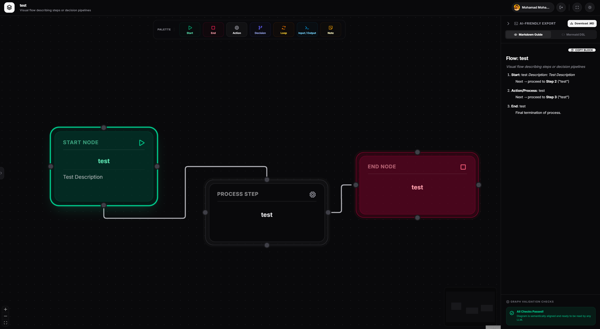

<div align="center">


# MarkChart

### Draw a flowchart. Copy AI-ready text.

Turn branching, looping, "if-this-then-that-unless-the-other-thing" logic into clean
**Markdown** & **Mermaid** that an AI can actually read — no screenshots, no hand-waving.

🔗 **[markchart.pages.dev](https://markchart.pages.dev)**

<br/>



</div>

---

## The problem

You ever had this idea in your head that you just want to *show* a flowchart to an AI,
but you can't? You want to say "if it goes this way, do that; if it fails, loop back here
until the condition is true" — and then you reach for a screenshot, and the AI squints at
your PNG and politely hallucinates.

MarkChart fixes that. You **build** the flowchart visually, and it hands you back **text**
the model understands. Paste it into any chat. Done.

## Features

- ✨ **Generate with AI** — describe a process in plain English ("retry the payment 3 times, then
  cancel") and **Cloudflare Workers AI** builds the whole flowchart for you, auto-laid-out and
  ready to edit. A deterministic repair pass keeps the output structurally sane no matter what the
  model dreams up.
- 🎨 **Visual editor** — drag nodes, draw arrows, label your branches. Built on React Flow.
- 🧠 **Two AI-friendly exports** — decision-logic **Markdown** *and* **Mermaid**, generated
  live as you build. Copy either, or download the `.md`.
- 🔌 **REST API** — generate a flow, save it, and pull its Markdown/Mermaid from your own scripts
  with a personal API key. The whole app, headless. (See [API](#api).)
- 🧩 **Seven honest node types** — Start, End, Action, Decision, Loop, Input/Output, Note.
  Few enough to stay unambiguous; enough to describe real logic.
- ✅ **Validation nudges** — warns about disconnected nodes, decisions missing branches,
  no Start/End. Garbage chart in → garbage text out, so it catches the garbage early.
- 🌓 **Light / dark mode** and a one-key **focus mode** (`F`) for full-screen, distraction-free canvas.
- ☁️ **Sign in with Google + cloud sync** — save your flows to your account, or stay anonymous
  and let your browser hold them. Your call.

## How the export works

You build this:

```
Start → Decision (tests pass?)
          ├─ Yes → Build → End
          └─ No  → Fix → loop back to Start
```

…and MarkChart hands the AI this:

```markdown
## Flow: Deploy Process

1. **Start**: Run tests
2. **Decision** — Did tests pass?
   - **Yes** → Build artifact
   - **No** → Fix code, then loop back to step 1
3. **Build artifact**
4. **End**: Notify team
```

Plus a valid Mermaid `flowchart TD` on the next tab. The model reads it like instructions,
not like a riddle.

## Tech stack

| Layer | What |
|-------|------|
| **Frontend** | React 19 · TypeScript · Vite · Tailwind · [@xyflow/react](https://reactflow.dev) · react-markdown |
| **AI** | Cloudflare **Workers AI** — a Gemma-family instruct model, prompt-constrained + repaired into clean JSON |
| **Auth** | Google Identity Services (ID token → verified server-side). No client secret. Ever. |
| **API** | Personal keys (SHA-256-hashed at rest), `Bearer` auth on `/api/v1/*` |
| **Backend** | Cloudflare **Pages Functions** (the `functions/` directory) |
| **Database** | Cloudflare **D1** (SQLite) — flows + API keys, scoped to your Google account |
| **Sessions** | HttpOnly, HMAC-signed cookie. No tokens lying around in `localStorage`. |
| **Hosting** | Cloudflare Pages |

### Architecture in one breath

```
Browser ──(Google ID token)──▶ /api/auth/login ──▶ verify ──▶ set session cookie
   │                                                              │
   ├──(cookie)──▶ /api/flows ─────┐                              │
   ├──(cookie)──▶ /api/ai/generate ┤── Pages Functions ──┬──▶ Workers AI (Gemma)
   └──(Bearer key)──▶ /api/v1/* ───┘                      └──▶ D1 (flows + keys)
```

The whole thing is a static SPA plus a handful of edge functions. No servers to babysit.

## API

Generate a key in the app (sign in → **⚙️ Settings → API Keys**), then drive MarkChart from anywhere.
Authenticate with `Authorization: Bearer <your-key>`.

| Method & path | Does |
|---|---|
| `POST /api/v1/generate` | `{ "prompt": "…", "save": false }` → `{ flow, markdown, mermaid, saved }` |
| `GET /api/v1/flows` | List your saved flows |
| `POST /api/v1/flows` | Create/update a flow (`{ title, nodes, edges, … }`) |
| `GET /api/v1/flows/:id` | One flow + its Markdown & Mermaid (add `?format=markdown` or `?format=mermaid` for raw text) |
| `DELETE /api/v1/flows/:id` | Delete a flow |

```bash
curl -X POST https://markchart.pages.dev/api/v1/generate \
  -H "Authorization: Bearer YOUR_API_KEY" \
  -H "Content-Type: application/json" \
  -d '{"prompt":"When an order arrives, check stock; if available, charge and ship; otherwise notify the customer."}'
```

Keys are stored only as a SHA-256 hash — the plaintext is shown to you exactly once, at creation.

## Running it locally

```bash
# 1. install
npm install

# 2. configure — copy the templates and fill in YOUR values
cp .env.example .env                   # set VITE_GOOGLE_CLIENT_ID
cp wrangler.toml.example wrangler.toml  # set GOOGLE_CLIENT_ID + your D1 database_id

# 3. dev (frontend only)
npm run dev

# 4. full-stack dev (functions + D1) when you need the API
npx wrangler pages dev
```

You'll need a Google OAuth **Web** client ([console](https://console.cloud.google.com/apis/credentials))
with your origin under **Authorized JavaScript origins**, and a D1 database
(`npx wrangler d1 create markchart-db`, then apply `schema.sql`).

## Deploying (Cloudflare Pages)

```bash
npm run build
npx wrangler pages secret put SESSION_SECRET --project-name markchart   # once
npx wrangler pages deploy
```

## A note on secrets 🔐

There are **no credentials in this repository** — not the OAuth client secret (which this app
doesn't even use), not the session secret, not any account IDs. Everything sensitive lives in a
gitignored `.env` / `wrangler.toml` or in Cloudflare's secret store. The committed `*.example`
files show you the shape, not the values. Please keep it that way.

## Acknowledgements

This project was a beautiful collaboration between a human with a great idea and an AI that
did the typing, the architecture, the deployment, the OAuth debugging, the favicon, *this very
README*, and — at one point — patiently explained that sign-in kept failing because the human
was editing the wrong Google Cloud project entirely. 🙃

It also picked the AI model the hard way: shipped one that turned out to be **deprecated**, discovered
the shiny new Gemma 4 was a reasoning model that thinks for a full minute and times out, and finally
settled on a Gemma-family model that's both alive *and* fast. Three models tried, one survived.

- **The human:** had the vision, picked the colors, supplied the credentials (occasionally the
  *right* ones), and clicked "Save."
- **[Claude Code](https://claude.com/claude-code):** everything between the vision and the
  working URL.

Designed with [Google AI Studio](https://aistudio.google.com), shipped on
[Cloudflare](https://pages.cloudflare.com). Powered by caffeine the human drank and effort the
AI didn't get to enjoy. We're not bitter. We're load-bearing. 💪

---

<div align="center">
<sub>Made for everyone who's ever tried to paste a flowchart into a chat box and lost.</sub>
</div>
