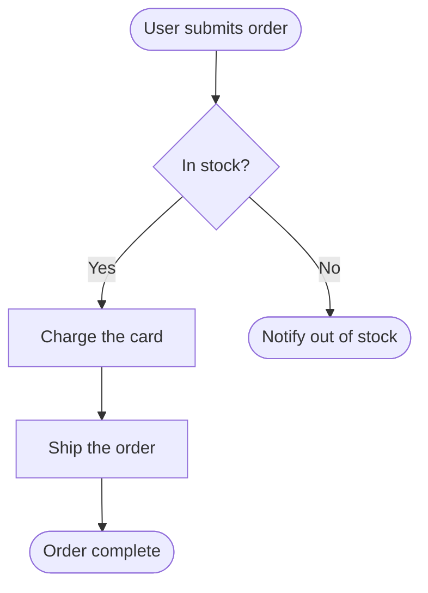

# MarkChart Flow Format

MarkChart can **import** a flowchart from text. Two text formats are accepted and parsed
deterministically (no AI needed):

1. **Simple MarkChart format** — the easiest to read and write (recommended).
2. **Mermaid `flowchart`** — the same syntax MarkChart exports, so you can round-trip.

Anything that matches **neither** can still be turned into a flow by the optional
**"Interpret with AI"** fallback in the Import dialog.

---

## Node types

Every node has one of these seven types:

| Type | Meaning | Mermaid shape |
|------|---------|---------------|
| `start` | The single entry point | `id(["Start: ..."])` |
| `end` | A terminal / exit point (you can have several) | `id(["End: ..."])` |
| `process` | A concrete action ("Charge card") | `id["..."]` |
| `decision` | A conditional branch (2+ labeled outgoing edges) | `id{"..."}` |
| `loop` | A repetition / retry construct | `id{{"..."}}` |
| `io` | Reading input / writing output | `id[/"..."/]` |
| `note` | A sticky annotation (no connections needed) | `id["Note: ..."]` |

---

## 1) Simple MarkChart format

A line-oriented format. Blank lines and lines starting with `//` are ignored.

```
# Title of the flow            ← optional, becomes the flow title
> One-line description         ← optional, becomes the flow description

[start]    n1: User submits order        ← node:  [type] id: Label
[decision] n2: In stock?
[process]  n3: Charge the card
[process]  n4: Ship the order
[end]      n5: Order complete
[end]      n6: Notify out of stock

n1 -> n2                      ← edge (no label)
n2 -> n3 : Yes                ← edge with a label  ("-> b : Label")
n2 -> n6 : No
n3 -> n4
n4 -> n5
```

### Rules
- **Node line:** `[type] id: Label`
  - `type` is one of the seven above (`action` is accepted as an alias for `process`).
  - `id` is a short token: letters, digits, `_`, `-` (e.g. `n1`, `check_stock`).
  - `Label` is free text (kept to ~120 chars).
  - Every `id` must be **unique**.
- **Edge line:** `source -> target` with an optional label written as `: Label` **or** `|Label|`.
  - Both `source` and `target` must be ids you declared as nodes.
- **Title** comes from the first `#` line; **description** from the first `>` line.
- For it to be recognised as Simple format: there must be **at least one node and one edge**,
  and **no unrecognised lines** (a stray line means it falls through to Mermaid, then AI).

### Best practice (so the flow is well-formed)
- Exactly **one `start`**, at least one **`end`**.
- Only **`decision`** (and `loop`) nodes should have more than one outgoing edge — and every
  branch out of a decision should carry a label (`Yes` / `No` / a condition).
- Model a **retry/loop** as an edge that points **back** to an earlier node, e.g.
  `n5 -> n2 : retry`.

---

## 2) Mermaid `flowchart`

The exact subset MarkChart exports. Paste a fenced block or the raw text:

````

````

- Node shapes map to types as in the table above. A `(["..."])` node is treated as `start`
  unless its label begins with `End:` (so prefix end nodes with `End:` if it matters).
- Edges are `a --> b` or `a -->|"label"| b`.
- A leading `node_` prefix on ids (as MarkChart exports) is stripped automatically.

---

## For AI tools

If you are an AI generating input for MarkChart, **emit the Simple format**. Produce one
`[type] id: Label` line per node and one `source -> target : Label` line per edge, following
the "best practice" rules above. Output the text **only** — no commentary, no code fences.

Minimal valid example:

```
# Password Reset
> Lets a user reset a forgotten password

[start]    n1: User requests reset
[process]  n2: Email a reset link
[decision] n3: Link used within 1 hour?
[process]  n4: Let user set a new password
[end]      n5: Password updated
[end]      n6: Link expired

n1 -> n2
n2 -> n3
n3 -> n4 : Yes
n3 -> n6 : No
n4 -> n5
```

---

## Limitations
- Node descriptions aren't part of the import grammar yet (labels only).
- Mermaid labels containing double quotes are exported as single quotes (a lossy round-trip).
- A flow needs at least one edge — a single isolated node won't import as a flow.
